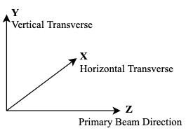
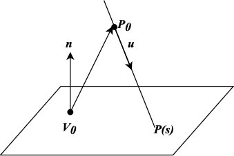
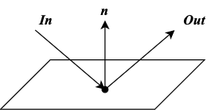
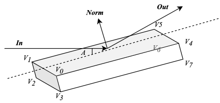

This document describes the geometry related to the ray tracing program.
# General Algorithm and Data Structure
## Coordinate System
The primary beam direction is defined on the ***Z*** direction (_TODO: check if negative Z works_). The horizontal transverse direction is defined as ***X*** and the vertical transverse is defined as ***Y***.

## Ray
A ray is defined is a start point (3D vector, `start`), a direction vector (`direction`, not necessarily nomalized) and a boolean variable `stopped` indicating whether the ray transport will be stopped.

## Intersection of a Ray and a Plane
A plane is defined as any point ***V0*** on the plane and the normal vector ***n*** of the plane.

Assume a ray is defined as the start point ***P0*** and the direction vector ***u***. It intersects with the plane at the point ***P(s)*** = ***P0*** + s * ***u***.

Since ***n*** **·** (***P(s)*** - ***V0***) = 0 and ***P(s)*** - ***V0*** = ***w*** + s * ***u***, where ***w*** = ***P0*** - ***V0***. We get the equation ***n*** **·** (***w*** + s * ***u***) = 0, solving which we get s = -(***n*** **·** ***w***) / (***n*** **·** ***u***).

[Reference](http://geomalgorithms.com/a05-_intersect-1.html)

## Reflection of Ray
***Out*** = ***In*** - 2 * (***In*** **·** ***n***) * ***n***

# Beam Source
## Criss Cross Source

# Optic Components
## Collimator

## Flat Mirror
A flat mirror is defined by the following parameters:
* Dimensions: `Length`, `Width` and `Thickness`
* `center`: the center of the mirror reflection surface
* `In`: the nominal input vector
* `Orientation`: `'x+', 'x-', 'y+', 'y-'` only
* `A`: the nominal incident angle
* `dA` (2,): mirror rotation range
* `trans` (2,): mirror transition range

The following parameters will be automatically calculated:
* `Out`: the nominal output vector
* `Norm`: the nominal normal vector
* `Vertex`: the 8 vertices of the mirror body (upstream vertices first).

